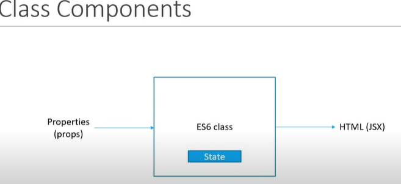

## Class Components

- ES6 Classes
- Similar functional component but takes props as an optional parameter
- Maintains private state confined to itself
- Uses this state / information to describe the User Interface
- Extends with React.Component
- Has render method, which returns HTML (JSX)

**Visualization**

