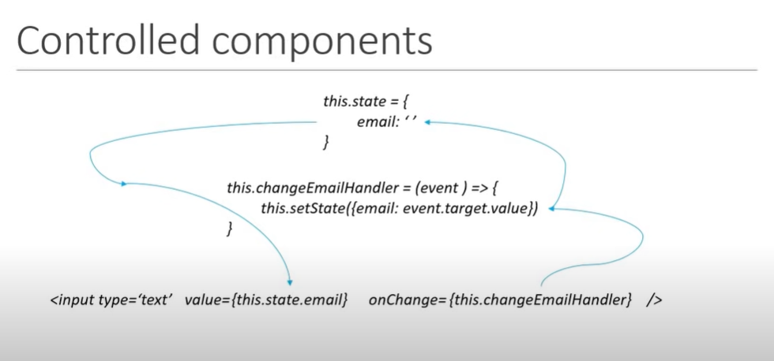

## Controlled Components in React

- React controls html form values using its `State`

A component in React said to be Controlled Component When the following criteria met:

1. Component's State should control  , for e.g, the html input values 
2. Change Handler will update the `State` again
3. State update  triggers render method again to sync with state values which are updated

### Detailed Explanation

In React v16, a controlled component maintains form data in React's state rather than relying on the DOM. This creates a loop:

1. User input triggers an event
2. The event handler updates React state
3. The component re-renders with the new state value
4. The input displays the updated value

### Visualization

