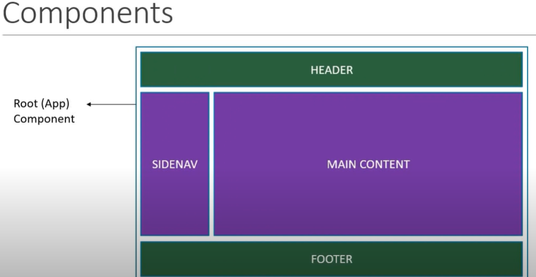
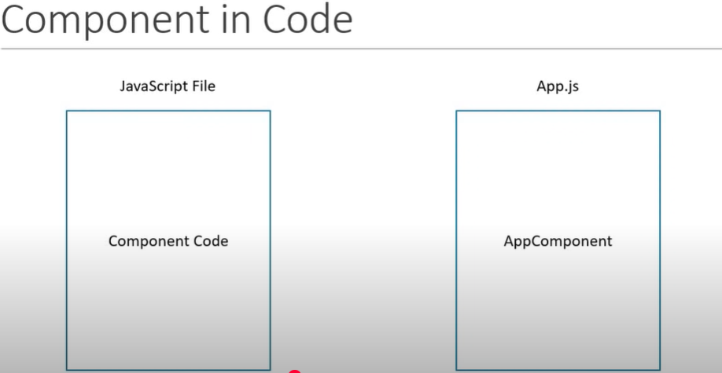

## Components

- Represents a Part of the User Interface
- Root Component contains all other components in a typical React Application
- All components combines to be make up the Entire Application
- Are also re-usable
- Can contain other components ( child component )
  

**Visualization:**
- 
  

**Component Code**

- code of the component is nothing but the content inside a .js / .jsx file

**Visualization:**
- 
  


## Component Types

1. Stateless Functional Components
2. Stateful Class Components


**Functional Components**

- A simple javascript function , which returns html content
- E.g: 
    ```javascript
        function welcome(props){

        return <h1>Hello , {props.name}</h1>

        }
    ```


**Class Components**

- Extends with React Component Class
- Must contain a render method
- Render method returns HTML Content
- E.g
  
  ```javascript
        class Welcome extends React.Component{

        render(){

         return <h1>Hello , {this.props.name}</h1>

        }
        }
    ```


