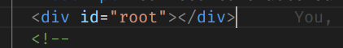

## package.json

- contains react version details
- scripts to run, build and test the app

## package-lock.json

- ensures consistency in installing packages 

## public folder

- `manifest.json` - for pwa
- `favicon` icon for react
- index.html  - -only html file in the application, served while rendering in web
    - To control the UI, we have root element through which React will control the UI
    - 
  
## src folder

- for development
- `index.js` - starting point for any react application
  - root component, dom element (root element) that's controlled by the React are specified
  - so the root( App ) component's node gets rendered inside the Root Elements DOM Node.

- `App.js` - represents the view in the browser
- `App.css` - for styling
- `App.test.js` - for unit tests
- `index.css` - applies style to the body tag

## Application Flow

-  once `npm start` command run,      
   -  `index.html` file served in the Browser
   -  index.html contains the root dom node
   -  Now the control goes to `index.js` where `ReactDOM `renders the `App Component` onto the `Root` DOM Node
   -  App component contains the HTML which gets displayed in the browser