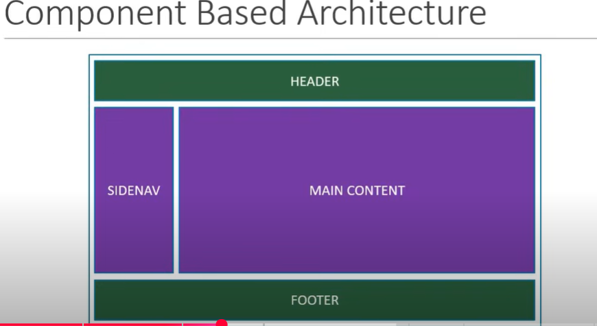

## React

- Learning React Version 16 in this series

**What is React ?**

- open source library for building the User Interfaces
- Its JavaScript library Not a framework
- Focuses on the rich UI
- Has rich ecosystem

**Why React ?**

- created by Meta
- Huge developer community
- More than 100k stars on github
- In demand skill-set

**Architecture:**

- Here, each section , meaning header, sidebar, main, footer represents a single component , composed into a page

- `Code re-usability` is possible through the component based architecture

**React is Declarative**

- Like we instruct `React` what UI we want and React will build that with its `React DOM`
- You will not be aware of how its (the UI) implemented behind
- handles the updating and rendering of components efficiently
- DOM updates handled gracefully in React

**What is imperative paradigm ?**

- Developer specify the each step to generate the UI we need,
- Developers will have the full control of each step

