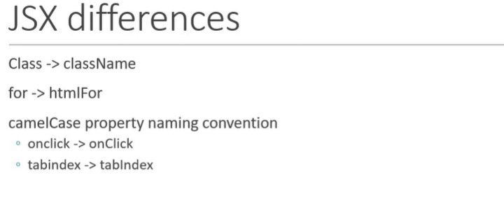

## JSX

- JavaScript XML 
- An Extension to javascript syntax
- Helps write XML code for elements and Components
- Not mandatory to write React Applications
- Makes react code simpler and readable
- Transpiles  to javascript to be understood to the Browser

**JSX Changes**

