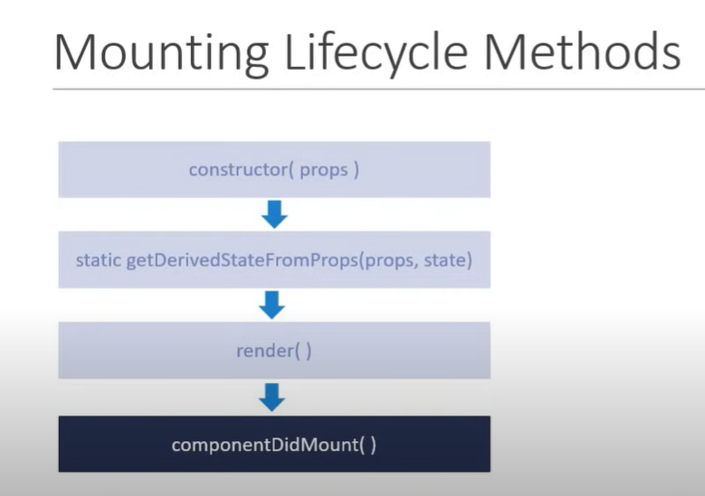

## Component Mounting Lifecycle Hooks in React v16.4

1. **Constructor**

   - called whenever a component is created
   - useful for state initialization, and binding event handlers
   - super(props) for overriding the state in Base Component
   - Make sure we do not cause any side effects like HTTP requests in constructor
   - Example:

   ```jsx
    class Test extends React.Component {
            super(props);
            // overrides state in Base Component (React.Component)
        constructor(props){
            // Also provides access to state object like below
            this.state = {
                // code
            }
        }
    }

    // To update state , we can use this.setState / setState if you have use useState Hook.
   ```

2. **static getDerivedStateFromProps(props, state)**
   - Used when `state of the component` depends on `props` over the time
   - called before `render()`
   - Should not induce any side effect like making HTTP requests inside this hook
   - Example:
   ```jsx
   export class extends React.Component {
    constructor(props){
        super(props);
        this.state ={
            name: '';
        }

       static getDerivedStateFromProps(props, state){
           // state, props
           return null ; // if no state change
       }
    }
   
   }
   ```
3. **render() Method**

   - the only required method in class components
   - used to read state, props and return jsx elements (UI)
   - Its `Pure Function`
   - Should render the same UI for given props and state
   - We should not be interacting with DOM or changing state or making HTTP requests inside it
   - contains Child component
   - Child component's life cycle methods also triggered
   - Example:

   ```jsx
   export class extends React.Component {
    constructor(props){
        super(props);
        this.state ={
            name: '';
        }
    }

    render() {
            // should not do the following actions:
            // update state
            // make api calls
            // or interaction with DOM
        return (

            <div>
                <h1> Render Method</h1>
            </div>
        )
    }
   }

   ```
4. **componentDidMount()**
   - Invoked immediately once the Component and its Children Components have been `rendered` in DOM
   - Side effects can be handled in this life cycle method like making HTTP requests for loading data etc.. / interacting with DOM 
  

**Order of Execution**
