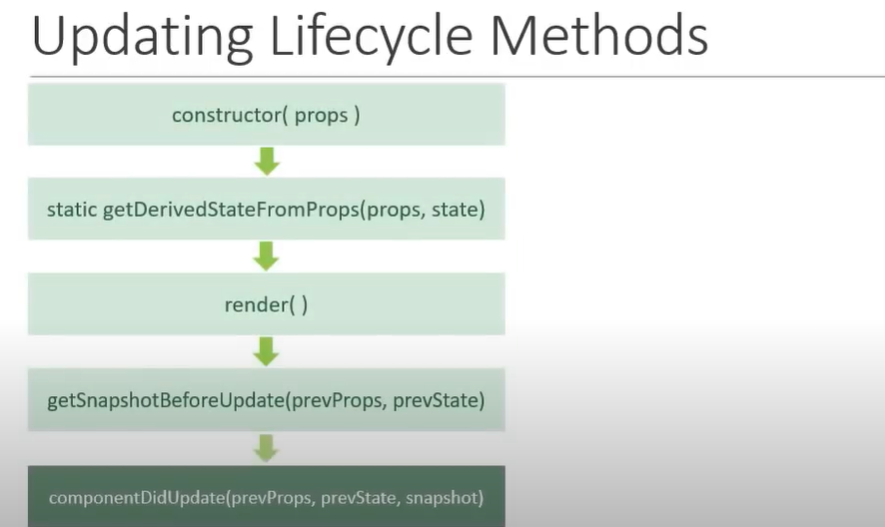

## Updating Life Cycle Methods in React v16.4

Triggered when a `component is being re-rendered` due to `change in props or state`

There are 4 Types:

1. **static getDerivedStateFromProps()**
   
   - this gets invoked whenever the component is getting re-rendered.
   - when state is dependent on props of the component
   - we should not be inducing any side effects like making HTTP Requests / interacting with DOM ...
   - rarely used method in updating phase of the component
   - Examples:
   ```jsx 
   class A extends React.Component {
    constructor(props){
        super(props);
        this.state={
            name: "Manish"
        }
    }

    // updating life cycle method
    static getDerivedStateFromProps(props, state){
        // process state based on changes in prop
        return null; // if no change in state
    }
   }
   
   ```

2. **shouldComponentUpdate(nextProps, nextState)**
   
   - Controls if a component should re-render or Not.
   - **Note:** We know that a class component gets re-rendered if there is a change in props or state
   - But this method can control this default nature of a class component being rendered if theres any change in the props or state by returning false
   - Avoid HTTP Requests, or State update using setState.
   - Best for Performance Optimization
   - Rarely used Life cycle Method.. according to React documentation.
   - Example:
  ```jsx 
    class A extends React.Component {
        // constructor with props and state


        // life cycle method
        shouldComponentUpdate(nextProps, nextState){
            // check previous props , state with next and control the re-rendering behavior
            return false; // controls re-rendering of a component based on changes in either props or state
        }

    }
  ```
3. **render()**
   
   Its same as Mounting Life Cycle Method

4. **getSnapshotBeforeUpdate(prevProps, prevStops)**
   
   - rarely used LC method
   - called right from changes in Virtual DOM are to be reflected in DOM
   - captures information about DOM
   - UseCase: ScrollPosition retrieval
  

5. **componentDidUpdate(prevProp, prevState, snapshot)**
   
   called after the render method finished in re-render cycles
   Means, it ensures that a Component and its child components are updated properly 

   - can induce side effects based on prev and current props value

**Execution Order**
