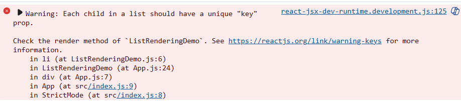

## List Rendering in React

List rendering is a fundamental concept in React that involves displaying multiple similar components or elements based on an array of data. Here's how it works in React v16:

### Basic List Rendering

In React, you typically use the JavaScript `map()` method to transform arrays of data into arrays of elements:

```jsx
const numbers = [1, 2, 3, 4, 5];
const listItems = numbers.map((number) =>
    <li>{number}</li>
);

// Then render the array of elements
<ul>{listItems}</ul>
```

### Using Keys

When creating lists, React requires a special `key` prop to efficiently update the UI:

```jsx
const todoItems = todos.map((todo) =>
    <li key={todo.id}>
        {todo.text}
    </li>
);
```

Keys should be:
- Unique among siblings
- Stable across re-renders
- Usually from your data (like IDs)

If key is not specified , it will render but throws an error . see in 
### Inline List Rendering

You can also render lists directly in JSX:

```jsx
function NumberList({ numbers }) {
    return (
        <ul>
            {numbers.map((number) =>
                <li >
                    {number}
                </li>
            )}
        </ul>
    );
}
```

### Nested Components Example

```jsx
function Blog({ posts }) {
    return (
        <div>
            {posts.map((post) =>
                <Post
                    id={post.id}
                    title={post.title}
                    content={post.content}
                />
            )}
        </div>
    );
}
```

### Common Patterns

1. **Filtering and rendering**:
```jsx
{users
    .filter(user => user.active)
    .map(user => <UserItem user={user} />)
}
```

2. **Conditional rendering within lists**:
```jsx
{items.map(item => (
    <div >
        {item.isSpecial ? <SpecialItem item={item} /> : <RegularItem item={item} />}
    </div>
))}
```

