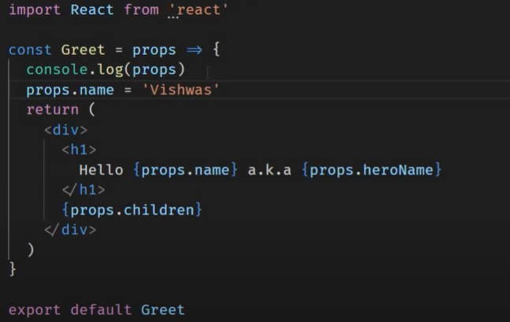

## Props

- Properties
- Allows component re-usability
- Allows specifying the attributes on components, which later can be accessible in component's definition
  
- Props are immutable, meaning cannot change values in Component's definition where the props was accessed
- 
- E.g assigning name (from below code snapshot) with another value will throw an error 
- 